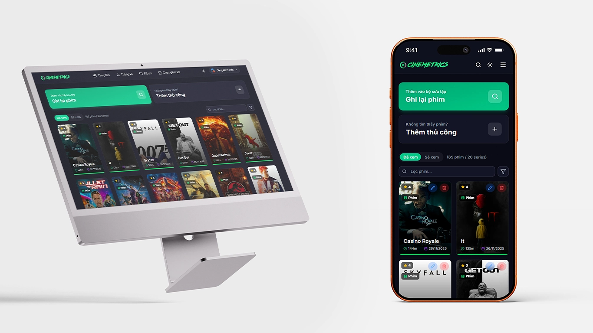

<div align="center">
  
</div>

Chào mừng đến với **Cinemetrics**! Đây là một ứng dụng để theo dõi và quản lý danh sách phim đã xem, giúp bạn lưu giữ những khoảnh khắc điện ảnh đáng nhớ. 🍿✨

## 🚀 Giới thiệu

Cinemetrics là một ứng dụng quản lý phim cá nhân thông minh với AI, cho phép bạn tìm kiếm phim từ cơ sở dữ liệu TMDB, nhận gợi ý phim từ AI, tạo album phim, theo dõi thống kê chi tiết và xây dựng bộ sưu tập điện ảnh của riêng bạn.

## ✨ Tính năng nổi bật

- **🔐 Đăng nhập/Đăng ký:** Bảo mật tài khoản với Authentication (Google Sign-in).
- **🔍 Tìm kiếm phim:** Tìm kiếm phim và TV shows nhanh chóng thông qua TMDB API với bộ lọc chi tiết.
- **🤖 Gợi ý phim bằng AI:** Nhận gợi ý phim cá nhân hóa dựa trên lịch sử xem của bạn.
- **📝 Quản lý danh sách:** Thêm phim đã xem, watchlist, ghi chú ngày xem, đánh giá và review.
- **📁 Quản lý Album:** Tạo album phim cá nhân, sắp xếp và quản lý bộ sưu tập.
- **👤 Trang người nổi tiếng:** Xem chi tiết thông tin diễn viên, đạo diễn với danh sách phim tham gia, bộ lọc và sắp xếp.
- **📊 Thống kê chi tiết:** Biểu đồ về số lượng phim, thể loại, quốc gia, đánh giá,...
- **🎲 Random Picker:** Chọn phim ngẫu nhiên từ bộ sưu tập của bạn.
- **📤 Xuất dữ liệu:** Xuất danh sách phim sang Excel/CSV.
- **🌓 Giao diện Dark/Light:** Chế độ sáng tối linh hoạt.
- **📱 Responsive:** Giao diện đẹp mắt, tương thích tốt trên cả máy tính và điện thoại.

<div align="center">
  
</div>

## 🛠️ Công nghệ sử dụng

- **Frontend:** [React](https://react.dev/) (v19.2.0), [TypeScript](https://www.typescriptlang.org/), [Vite](https://vitejs.dev/) (v6.2.0)
- **Styling:** [Tailwind CSS](https://tailwindcss.com/) (v4.1.17), [Lucide React](https://lucide.dev/) (v0.554.0)
- **Routing:** [React Router DOM](https://reactrouter.com/) (v7.9.6)
- **State Management:** [Zustand](https://zustand-demo.pmnd.rs/) (v5.0.8)
- **Backend & Database:** [Firebase](https://firebase.google.com/) (v12.6.0) (Firestore, Auth)
- **API:** [The Movie Database (TMDB)](https://www.themoviedb.org/), [OpenRouter AI](https://openrouter.ai/)
- **Charts:** [Recharts](https://recharts.org/) (v3.4.1)
- **Animation:** [Lottie React](https://lottiereact.com/) (v2.4.1)
- **Export:** [xlsx](https://www.npmjs.com/package/xlsx) (v0.18.5), [file-saver](https://www.npmjs.com/package/file-saver) (v2.0.5)

## ⚙️ Cài đặt và chạy dự án

1.  **Clone repository:**

    ```bash
    git clone https://github.com/dexter826/cinemetrics.git
    cd cinemetrics
    ```

2.  **Cài đặt dependencies:**

    ```bash
    npm install
    ```

3.  **Cấu hình môi trường:**
    Tạo file `.env` ở thư mục gốc và thêm các key cần thiết (Firebase config, TMDB API Key, OpenRouter API Key). Ví dụ:

    ```env
    # Firebase Configuration
    VITE_FIREBASE_API_KEY=...
    VITE_FIREBASE_AUTH_DOMAIN=...
    VITE_FIREBASE_PROJECT_ID=...
    VITE_FIREBASE_STORAGE_BUCKET=...
    VITE_FIREBASE_MESSAGING_SENDER_ID=...
    VITE_FIREBASE_APP_ID=...

    # TMDB API
    VITE_TMDB_API_KEY=...

    # OpenRouter AI (for movie recommendations)
    VITE_OPENROUTER_API_KEY=...
    ```

    _(Lưu ý: Cần tự tạo project trên Firebase, đăng ký tài khoản TMDB để lấy key, và đăng ký OpenRouter để sử dụng AI recommendations)_

4.  **Chạy dự án:**
    ```bash
    npm run dev
    ```
    Mở trình duyệt và truy cập đường link hiển thị trong terminal.

## 📂 Cấu trúc thư mục

```
cinemetrics/
 public/              # File tĩnh (manifest, robots.txt, logo, animations,...)
 src/
   components/        # Các component React
     auth/           # Component đăng nhập
     layout/         # Layout components (Layout, Navbar, Footer)
     modals/         # Modal components (AddMovie, AlbumSelector, Export, MovieDetail, RandomPicker)
     pages/          # Page components (Dashboard, SearchPage, StatsPage, AlbumsPage, AlbumDetailPage, PersonDetailPage)
     providers/      # React Context providers (AuthProvider, ThemeProvider, AlbumStoreInitializer, RecommendationsStoreInitializer)
     ui/             # UI components (AlertContainer, CustomDropdown, Loading, MovieCard, MultiSelectDropdown, Pagination, ScrollToTop, SplashScreen, StatsCard, ToastContainer)
   services/          # API services (aiService, albumService, exportService, movieService, tmdbService)
   stores/           # Zustand stores (addMovieStore, albumStore, alertStore, exportStore, recommendationsStore, toastStore)
   utils/            # Utility functions (movieUtils)
   App.tsx           # Component chính, routing
   constants.ts      # Hằng số và cấu hình
   firebase.ts       # Cấu hình Firebase
   index.css         # Global styles
   index.tsx         # Entry point
   types.ts          # Định nghĩa kiểu dữ liệu TypeScript
 index.html          # File HTML chính
 package.json        # Khai báo dependencies
 tailwind.config.js  # Cấu hình Tailwind
 vite.config.ts      # Cấu hình Vite
 .env.example        # Template cho environment variables
 firebase.json       # Cấu hình Firebase
```

---

<div align="center">Made with ❤️ by <a href="https://github.com/dexter826">MOB</a></div>
