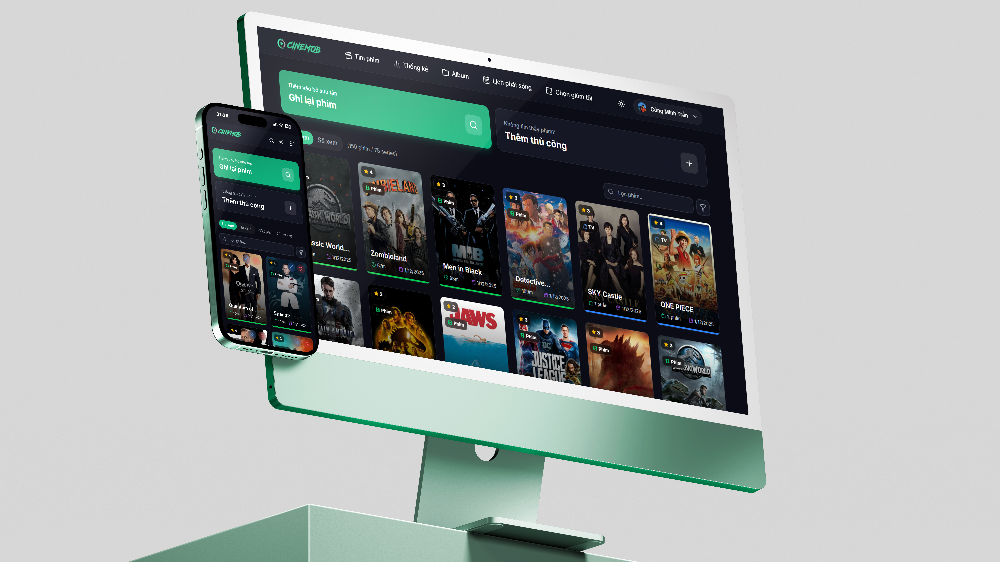
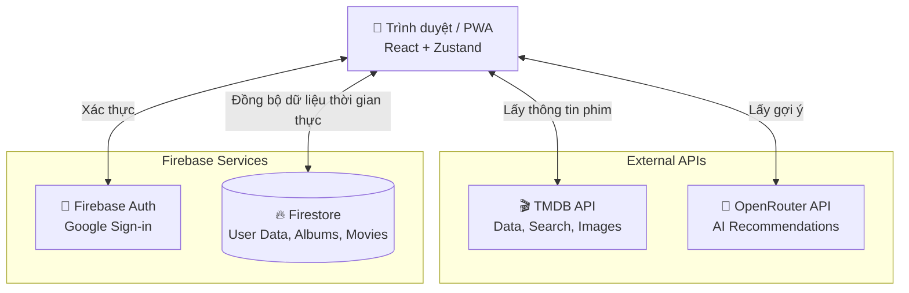

<div align="center">
  
  <br />
  <h3>Cine Over B**ch !! 🎞️✨</h3>
  <p><strong>Người bạn đồng hành lý tưởng cho những tín đồ điện ảnh</strong></p>

  <p>
    <a href="#-giới-thiệu">Giới thiệu</a> •
    <a href="#-tính-năng-chính">Tính năng</a> •
    <a href="#-kiến-trúc-tổng-quan">Kiến trúc</a> •
    <a href="#-cài-đặt">Cài đặt</a> •
    <a href="#-chạy-project">Chạy dự án</a> •
    <a href="#-hướng-dẫn-đóng-góp">Đóng góp</a>
  </p>
</div>

---

## 🚀 Giới thiệu

**CineMOB** là một ứng dụng web/PWA hiện đại được xây dựng nhằm mang lại trải nghiệm tuyệt vời nhất cho việc theo dõi, quản lý và khám phá phim ảnh. Không chỉ dừng lại ở việc lưu trữ danh sách phim đã xem, CineMOB tích hợp trí tuệ nhân tạo (AI) để đưa ra những gợi ý cá nhân hóa, đồng thời cung cấp các công cụ trực quan để bạn thống kê lại thói quen giải trí của mình.

<div align="center">
  
</div>

---

## ✨ Tính năng chính

- **🔐 Xác thực an toàn:** Đăng nhập nhanh chóng và bảo mật qua Google (Firebase Auth).
- **🔍 Khám phá vô tận:** Tích hợp API của TMDB, cho phép tìm kiếm mọi bộ phim, TV show và diễn viên với các bộ lọc nâng cao.
- **🤖 AI Gợi ý thông minh:** Tận dụng OpenRouter AI để phân tích sở thích và đưa ra các đề xuất phim chuẩn xác.
- **📅 Lịch phát sóng TV (TV Calendar):** Tự động theo dõi tiến độ xem TV Show và nhắc nhở lịch ra mắt tập mới.
- **📁 Quản lý Album cá nhân:** Tự do sắp xếp phim theo các bộ sưu tập hoặc chủ đề riêng biệt.
- **📊 Thống kê & Phân tích:** Trực quan hóa dữ liệu xem phim của bạn qua biểu đồ sinh động (Recharts): thể loại yêu thích, số lượng phim theo năm, điểm đánh giá...
- **🎲 Random Picker:** Phân vân không biết xem gì? Hãy để CineMOB chọn ngẫu nhiên một bộ phim trong Watchlist của bạn.
- **📱 Trải nghiệm PWA:** Hỗ trợ cài đặt trên điện thoại và máy tính như một ứng dụng Native, bao gồm cả Push Notifications.
- **📤 Export Dữ liệu:** Dễ dàng trích xuất toàn bộ dữ liệu phim cá nhân ra file Excel (.xlsx) để lưu trữ.
- **🌓 Giao diện tùy chỉnh:** Hỗ trợ Light/Dark mode với thiết kế tối giản, hiện đại bằng Tailwind CSS.

---

## 🏗 Kiến trúc tổng quan

CineMOB áp dụng kiến trúc **Serverless** kết hợp với **BaaS (Backend-as-a-Service)** thông qua Firebase. Toàn bộ logic ứng dụng được xử lý tại Client (CSR - Client Side Rendering).


```mermaid
graph TD
    Client[📱 Trình duyệt / PWA\nReact + Zustand]

    subgraph External APIs
        TMDB[🎬 TMDB API\nData, Search, Images]
        AI[🧠 OpenRouter API\nAI Recommendations]
    end

    subgraph Firebase Services
        Auth[🔐 Firebase Auth\nGoogle Sign-in]
        DB[(🔥 Firestore\nUser Data, Albums, Movies)]
    end

    Client <-->|Lấy thông tin phim| TMDB
    Client <-->|Lấy gợi ý| AI
    Client <-->|Xác thực| Auth
    Client <-->|Đồng bộ dữ liệu thời gian thực| DB
```

**Công nghệ cốt lõi:**

- **Frontend Framework:** React 19, TypeScript
- **Build Tool:** Vite 6
- **Styling:** Tailwind CSS v4, Lucide React, Framer Motion
- **State Management:** Zustand 5
- **Database & Auth:** Firebase v12
- **Khác:** PWA (vite-plugin-pwa), Recharts, XLSX

---

## ⚙️ Cài đặt

### Yêu cầu hệ thống

- **Node.js**: Phiên bản `18.x` trở lên (Khuyến nghị dùng bản LTS).
- **Trình quản lý gói**: `npm` (hoặc `yarn`, `pnpm`).

### Các bước cài đặt

1. **Clone dự án về máy:**

   ```bash
   git clone https://github.com/dexter826/cinemob.git
   cd cinemob
   ```

2. **Cài đặt các thư viện (dependencies):**
   ```bash
   npm install
   ```

---

## 🔑 Env configuration (Cấu hình biến môi trường)

Để ứng dụng có thể kết nối tới các dịch vụ bên ngoài, bạn cần thiết lập biến môi trường.

1. Tạo file `.env` tại thư mục gốc của dự án.
2. Bạn có thể tham khảo file `.env.example` và điền các thông tin sau:

```env
# 1. CẤU HÌNH FIREBASE
# Lấy tại: Firebase Console -> Project Settings -> General -> Your apps
VITE_FIREBASE_API_KEY="your_firebase_api_key"
VITE_FIREBASE_AUTH_DOMAIN="your-app.firebaseapp.com"
VITE_FIREBASE_PROJECT_ID="your-project-id"
VITE_FIREBASE_STORAGE_BUCKET="your-app.appspot.com"
VITE_FIREBASE_MESSAGING_SENDER_ID="your_sender_id"
VITE_FIREBASE_APP_ID="your_app_id"

# 2. CẤU HÌNH API
# Lấy tại: https://www.themoviedb.org/settings/api
VITE_TMDB_API_KEY="your_tmdb_api_key"

# Lấy tại: https://openrouter.ai/keys
VITE_OPENROUTER_API_KEY="your_openrouter_api_key"
```

---

## ▶️ Chạy project

Sau khi đã hoàn tất cài đặt và cấu hình `.env`, bạn có thể khởi chạy ứng dụng:

**Môi trường phát triển (Development):**

```bash
npm run dev
```

> Ứng dụng sẽ tự động chạy tại địa chỉ: `http://localhost:5173` (hoặc cổng được hiển thị trên Terminal).

**Build cho Production:**

```bash
npm run build
npm run preview
```

---

## 📂 Cấu trúc thư mục

Dự án được tổ chức theo tính năng (Feature-based) kết hợp với các lớp kiến trúc rõ ràng để dễ dàng mở rộng và bảo trì:

```text
cinemob/
├── .github/                 # Cấu hình GitHub Actions (CI/CD)
├── public/                  # Tài nguyên tĩnh (Manifest, Icons, Lottie data...)
├── src/
│   ├── assets/              # Hình ảnh, âm thanh nội bộ
│   ├── components/          # UI Components chia nhỏ có thể tái sử dụng
│   │   ├── auth/            # Màn hình đăng nhập
│   │   ├── layout/          # Bố cục chính (Navbar, Footer, MobileNav)
│   │   ├── modals/          # Các popup (Thêm phim, Chọn ngẫu nhiên...)
│   │   ├── ui/              # Components cơ sở (Button, Card, Dropdown...)
│   │   └── ...
│   ├── constants/           # Hằng số cấu hình (config, messages, route)
│   ├── hooks/               # Custom React Hooks chứa logic nghiệp vụ
│   ├── pages/               # Các trang chính (Dashboard, Search, Stats...)
│   ├── services/            # Lớp logic giao tiếp API ngoài (TMDB, Firebase, AI)
│   ├── stores/              # Zustand global state (quản lý trạng thái toàn cục)
│   ├── types/               # TypeScript interfaces & types
│   ├── utils/               # Các hàm tiện ích (Helper functions)
│   ├── App.tsx              # Root component & quản lý định tuyến
│   └── index.tsx            # Entry point của ứng dụng
├── package.json             # Quản lý dependencies và scripts
└── vite.config.ts           # Cấu hình Vite build tool
```

---

## 🤝 Hướng dẫn đóng góp

Mọi sự đóng góp đều được chào đón nồng nhiệt để làm cho CineMOB ngày một hoàn thiện hơn! Dưới đây là quy trình chuẩn để bạn bắt đầu:

1. **Fork** dự án này về tài khoản GitHub của bạn.
2. **Clone** bản fork về máy tính cục bộ.
3. Tạo một branch mới cho tính năng hoặc bản vá lỗi của bạn:
   ```bash
   git checkout -b feature/ten-tinh-nang-moi
   ```
4. Commit các thay đổi với thông điệp rõ ràng, súc tích:
   ```bash
   git commit -m "Thêm tính năng hiển thị trailer phim"
   ```
5. Push lên branch vừa tạo:
   ```bash
   git push origin feature/ten-tinh-nang-moi
   ```
6. Mở một **Pull Request (PR)** trên kho lưu trữ gốc mô tả chi tiết những thay đổi của bạn.

---

## 📄 Giấy phép (License)

Dự án được phân phối dưới giấy phép **MIT**. Mọi người có thể tự do sử dụng, sao chép, sửa đổi, hợp nhất, xuất bản, phân phối.

---

<div align="center">
  <b>Được xây dựng với niềm đam mê điện ảnh ❤️</b>
</div>
