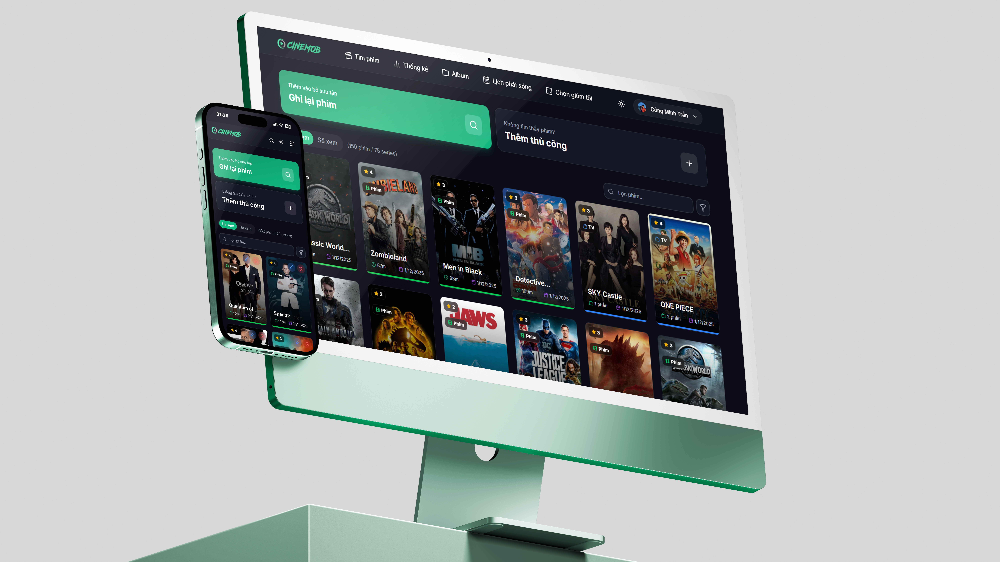
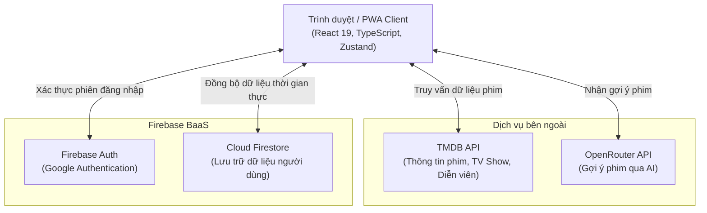

<div align="center">
  
  <p>PWA theo dõi và quản lý danh mục phim ảnh, TV show cá nhân.</p>

  <p>
    
    
    
    
    
  </p>
</div>

---

## Tổng quan

**CineMOB** là ứng dụng web client-side (CSR) dạng PWA xây dựng bằng React 19 và TypeScript, hỗ trợ theo dõi danh mục phim ảnh, quản lý lịch chiếu và phân tích thói quen giải trí với giao diện tối ưu cho thiết bị di động.

<div align="center">
  
</div>

### Tính năng nổi bật

- **Khám phá & Tra cứu:** Tìm kiếm phim, TV show, diễn viên, xem trailer và đánh giá chi tiết từ TMDB.
- **Quản lý danh sách xem:** Phân loại theo trạng thái (Đang xem, Đã xem, Muốn xem) và tạo album theo chủ đề riêng.
- **Lịch phát sóng:** Theo dõi lịch chiếu tập mới theo tuần/tháng để không bỏ lỡ các series yêu thích.
- **Gợi ý phim thông minh:** Đề xuất phim phù hợp ngữ cảnh và sở thích người dùng qua AI (OpenRouter).
- **Thống kê & Xuất báo cáo:** Trực quan hóa thói quen giải trí qua biểu đồ (Recharts) và hỗ trợ xuất danh sách ra file Excel (.xlsx).
- **Hỗ trợ PWA:** Cài đặt nhanh chóng trên thiết bị di động và máy tính, hoạt động mượt mà ngay cả khi kết nối mạng không ổn định.

### Tích hợp chính

- **Dữ liệu điện ảnh:** Lấy thông tin phim, TV show, diễn viên và lịch chiếu từ [TMDB API](https://www.themoviedb.org/documentation/api).
- **Xác thực & Lưu trữ:** Sử dụng Firebase v12 (Google Sign-In qua Firebase Auth và đồng bộ dữ liệu thời gian thực qua Cloud Firestore).
- **Trợ lý gợi ý:** Tích hợp [OpenRouter API](https://openrouter.ai/) để đề xuất phim theo ngữ cảnh và sở thích người xem.
- **Thống kê & Xuất dữ liệu:** Trực quan hóa dữ liệu bằng [Recharts](https://recharts.org/) và hỗ trợ xuất danh sách phim ra file Excel (.xlsx) với SheetJS.

### Kiến trúc ứng dụng


```mermaid
graph TD
    Client["Trình duyệt / PWA Client<br/>(React 19, TypeScript, Zustand)"]

    subgraph External_Services["Dịch vụ bên ngoài"]
        TMDB["TMDB API<br/>(Thông tin phim, TV Show, Diễn viên)"]
        OpenRouter["OpenRouter API<br/>(Gợi ý phim qua AI)"]
    end

    subgraph Firebase_Services["Firebase BaaS"]
        Auth["Firebase Auth<br/>(Google Authentication)"]
        Firestore["Cloud Firestore<br/>(Lưu trữ dữ liệu người dùng)"]
    end

    Client <-->|Truy vấn dữ liệu phim| TMDB
    Client <-->|Nhận gợi ý phim| OpenRouter
    Client <-->|Xác thực phiên đăng nhập| Auth
    Client <-->|Đồng bộ dữ liệu thời gian thực| Firestore
```

---

## Yêu cầu môi trường

- **Node.js**: Phiên bản `18.x` trở lên (khuyến nghị bản LTS `20.x`).
- **Trình quản lý gói**: `npm` (đã có sẵn `package-lock.json`).

---

## Khởi chạy cục bộ

1. **Clone repository:**
   ```bash
   git clone https://github.com/dexter826/cinemetrics.git
   cd cinemetrics
   ```

2. **Cài đặt dependencies:**
   ```bash
   npm install
   ```

3. **Cấu hình biến môi trường:**
   Tạo file `.env` tại thư mục gốc từ mẫu `.env.example`:
   ```bash
   cp .env.example .env
   ```
   Cập nhật các giá trị tương ứng trong file `.env`:
   - `VITE_TMDB_API_KEY`: API Key lấy từ The Movie Database.
   - `VITE_FIREBASE_*`: Thông số cấu hình từ Firebase Console.
   - `VITE_OPENROUTER_API_KEY`: API Key lấy từ OpenRouter.

   > [!NOTE]
   > Các biến có tiền tố `VITE_` sẽ được nhúng trực tiếp vào mã nguồn client-side trên trình duyệt. Không đưa các khóa bí mật mang quyền quản trị vào các biến này.

4. **Chạy server phát triển:**
   ```bash
   npm run dev
   ```
   Ứng dụng khởi chạy tại địa chỉ: `http://localhost:3000` (cấu hình trong [vite.config.ts](vite.config.ts)).

---

## Các lệnh chính

| Lệnh | Mô tả |
| :--- | :--- |
| `npm run dev` | Khởi chạy Vite development server tại cổng `3000` (hỗ trợ chế độ PWA dev). |
| `npm run build` | Đóng gói mã nguồn cho môi trường production vào thư mục `dist/`. |
| `npm run preview` | Chạy máy chủ nội bộ để kiểm tra bản build production tại `dist/`. |
| `npm run typecheck` | Kiểm tra kiểu dữ liệu TypeScript không xuất file. |
| `npm run lint` | Chạy ESLint kiểm tra mã nguồn trong `src/`. |
| `npm test` | Chạy kiểm thử tự động với Vitest trên các file `src/**/*.test.ts`. |

---

## Kiểm tra chất lượng mã nguồn

Dự án dùng Vitest cho unit test và ESLint để kiểm tra chuẩn mã nguồn. Trước khi mở Pull Request hoặc bàn giao thay đổi, hãy chạy bộ lệnh:

```bash
npm run typecheck
npm run lint
npm test
npm run build
```

Dùng `npm run preview` để kiểm tra bản build production trước khi tạo Pull Request.

---

## Cấu trúc repository

Cấu trúc các thư mục và tập tin chính trong dự án:

```text
├── .github/              # Workflow GitHub Actions (thông báo tập phim qua cron)
├── docs/                 # Tài liệu dự án và hình ảnh minh họa (logo, mockup)
├── public/               # Tài nguyên tĩnh phục vụ trực tiếp (manifest, icons, lottie data)
├── src/                  # Toàn bộ mã nguồn ứng dụng
│   ├── app/              # Cấu hình ứng dụng và định tuyến (router)
│   ├── assets/           # Tài nguyên hình ảnh, âm thanh nội bộ
│   ├── constants/        # Hằng số hệ thống và danh sách routes
│   ├── features/         # Các module tính năng (auth, movies, albums, calendar, ...)
│   ├── lib/              # Khởi tạo và cấu hình thư viện ngoài (Firebase, ...)
│   ├── shared/           # Components, hooks, stores và utilities dùng chung
│   └── types/            # Khai báo interfaces và types TypeScript
├── .env.example          # Danh sách biến môi trường mẫu
├── DESIGN.md             # Đặc tả hệ thống thiết kế (Design System)
├── firebase.json         # Cấu hình triển khai Firebase Hosting & Firestore
├── firestore.rules       # Quy tắc phân quyền và bảo mật Firestore
├── package.json          # Khai báo dependencies và scripts
├── tsconfig.json         # Cấu hình biên dịch TypeScript
└── vite.config.ts        # Cấu hình máy chủ Vite, React, Tailwind và PWA
```

---

## Nguồn dữ liệu

Dự án sử dụng dữ liệu từ [The Movie Database (TMDB)](https://www.themoviedb.org/).

> [!NOTE]
> Sản phẩm này sử dụng TMDB API nhưng không được chứng thực hoặc xác nhận bởi TMDB.

---

## Giấy phép

Dự án được phân phối theo giấy phép [MIT](LICENSE).
