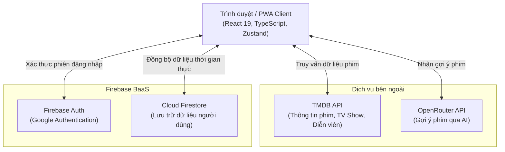

<div align="center">
  
  <p>Ứng dụng Progressive Web App (PWA) hỗ trợ theo dõi, quản lý phim và TV show cá nhân.</p>

  <p>
    
    
    
    
    
  </p>
</div>

---

## Tổng quan

**CineMOB** là ứng dụng web client-side (CSR) dạng PWA được xây dựng bằng React 19 và TypeScript, phục vụ nhu cầu quản lý danh mục phim ảnh cá nhân. Ứng dụng cung cấp các công cụ theo dõi danh sách xem, quản lý album, theo dõi lịch phát sóng truyền hình, nhận gợi ý phim và phân tích dữ liệu giải trí qua biểu đồ.

<div align="center">
  
</div>

### Tích hợp chính

- **Dữ liệu điện ảnh:** Khai thác thông tin phim, TV show, diễn viên và lịch chiếu từ [TMDB API](https://www.themoviedb.org/documentation/api).
- **Xác thực & Lưu trữ:** Sử dụng Firebase v12 (Google Sign-In qua Firebase Auth và đồng bộ dữ liệu người dùng qua Cloud Firestore).
- **Trợ lý gợi ý:** Tích hợp [OpenRouter API](https://openrouter.ai/) để đưa ra gợi ý phim theo ngữ cảnh người dùng.
- **Thống kê & Xuất dữ liệu:** Trực quan hóa dữ liệu qua [Recharts](https://recharts.org/) và hỗ trợ xuất danh sách phim ra file Excel (.xlsx) bằng SheetJS.

### Kiến trúc ứng dụng


```mermaid
graph TD
    Client["Trình duyệt / PWA Client<br/>(React 19, TypeScript, Zustand)"]

    subgraph External_Services["Dịch vụ bên ngoài"]
        TMDB["TMDB API<br/>(Thông tin phim, TV Show, Diễn viên)"]
        OpenRouter["OpenRouter API<br/>(Gợi ý phim qua AI)"]
    end

    subgraph Firebase_Services["Firebase BaaS"]
        Auth["Firebase Auth<br/>(Google Authentication)"]
        Firestore["Cloud Firestore<br/>(Lưu trữ dữ liệu người dùng)"]
    end

    Client <-->|Truy vấn dữ liệu phim| TMDB
    Client <-->|Nhận gợi ý phim| OpenRouter
    Client <-->|Xác thực phiên đăng nhập| Auth
    Client <-->|Đồng bộ dữ liệu thời gian thực| Firestore
```

---

## Yêu cầu môi trường

- **Node.js**: Phiên bản `18.x` trở lên (khuyến nghị phiên bản LTS `20.x`).
- **Trình quản lý gói**: `npm` (repository đã có sẵn `package-lock.json`).

---

## Cấu hình biến môi trường

Ứng dụng yêu cầu cấu hình các khóa API và thông tin dự án Firebase trước khi khởi chạy.

1. Tạo file `.env` tại thư mục gốc từ mẫu `.env.example`:
   ```bash
   cp .env.example .env
   ```
2. Điền các giá trị thực tế vào file `.env`. Danh sách các biến cần thiết được quản lý trực tiếp trong [.env.example](.env.example):
   - `VITE_TMDB_API_KEY`: API Key lấy từ The Movie Database.
   - `VITE_FIREBASE_*`: Các thông số cấu hình ứng dụng web từ Firebase Console.
   - `VITE_OPENROUTER_API_KEY`: API Key lấy từ OpenRouter.

> [!NOTE]
> Các biến bắt đầu bằng tiền tố `VITE_` được đóng gói trực tiếp vào mã nguồn client-side của trình duyệt. Không lưu các khóa bí mật mang quyền quản trị cấp cao vào các biến này.

---

## Khởi chạy cục bộ

1. **Clone repository:**
   ```bash
   git clone https://github.com/dexter826/cinemetrics.git
   cd cinemetrics
   ```

2. **Cài đặt dependencies:**
   ```bash
   npm install
   ```

3. **Thiết lập file cấu hình môi trường:**
   Tạo file `.env` và khai báo các thông số theo hướng dẫn ở phần trên.

4. **Chạy server phát triển:**
   ```bash
   npm run dev
   ```
   Ứng dụng sẽ khởi chạy tại địa chỉ: `http://localhost:3000` (được cấu hình trong [vite.config.ts](vite.config.ts)).

---

## Các lệnh chính

| Lệnh | Mô tả |
| :--- | :--- |
| `npm run dev` | Khởi chạy Vite development server tại cổng `3000` (hỗ trợ chế độ PWA dev). |
| `npm run build` | Đóng gói mã nguồn cho môi trường production vào thư mục `dist/`. |
| `npm run preview` | Khởi chạy máy chủ nội bộ để kiểm tra bản build production tại `dist/`. |
| `npx tsc --noEmit` | Kiểm tra tính toàn vẹn kiểu dữ liệu TypeScript (không tạo file đầu ra). |

---

## Kiểm tra chất lượng mã nguồn

Repository hiện chưa thiết lập test runner tự động. Trước khi mở Pull Request hoặc bàn giao thay đổi, cần thực hiện kiểm tra chất lượng thủ công:

1. **Kiểm tra kiểu dữ liệu:**
   ```bash
   npx tsc --noEmit
   ```
2. **Kiểm tra quy trình build production:**
   ```bash
   npm run build
   ```
3. **Kiểm tra giao diện và tính năng:**
   Chạy `npm run preview` để kiểm tra trực tiếp các luồng đăng nhập, tra cứu phim, thêm phim vào danh sách và khả năng đáp ứng trên các kích thước màn hình.

---

## Cấu trúc repository

Cấu trúc các thư mục và tập tin chính tại cấp cao nhất của repository:

```text
├── .agents/              # Cấu hình và kỹ năng dành cho AI Coding Assistant
├── .github/              # Workflow GitHub Actions (thông báo tập phim qua cron)
├── docs/                 # Tài liệu dự án và hình ảnh minh họa (logo, mockup)
├── public/               # Tài nguyên tĩnh phục vụ trực tiếp (manifest, icons, lottie data)
├── src/                  # Toàn bộ mã nguồn ứng dụng
│   ├── app/              # Cấu hình cấp ứng dụng và router
│   ├── assets/           # Tài sản hình ảnh, âm thanh nội bộ
│   ├── components/       # Các UI components tái sử dụng
│   ├── constants/        # Các hằng số hệ thống và routes
│   ├── features/         # Các module chức năng theo nghiệp vụ (auth, movies, ...)
│   ├── hooks/            # Custom React hooks
│   ├── pages/            # Các màn hình chính của ứng dụng
│   ├── services/         # Lớp giao tiếp API bên ngoài (TMDB, Firebase, OpenRouter)
│   ├── stores/           # Quản lý trạng thái toàn cục với Zustand
│   ├── types/            # Định nghĩa các interfaces và types TypeScript
│   └── utils/            # Các hàm trợ giúp và tiện ích dùng chung
├── .env.example          # Danh sách biến môi trường mẫu
├── AGENTS.md             # Quy ước đóng góp mã nguồn và kiến trúc cho developer/agent
├── DESIGN.md             # Tài liệu đặc tả hệ thống thiết kế (Design System)
├── PRODUCT.md            # Tài liệu định vị và mục tiêu sản phẩm
├── firebase.json         # Cấu hình triển khai Firebase
├── firestore.rules       # Quy tắc phân quyền và bảo mật Firestore
├── package.json          # Khai báo dependencies và scripts
├── tsconfig.json         # Cấu hình biên dịch TypeScript
└── vite.config.ts        # Cấu hình máy chủ Vite, plugin React, Tailwind và PWA
```

---

## Tài liệu liên quan

- [AGENTS.md](AGENTS.md): Quy ước kiến trúc, phong cách viết code TypeScript, quy tắc đặt tên và hướng dẫn đóng góp.
- [DESIGN.md](DESIGN.md): Hệ thống thiết kế CineMOB, bảng màu (Neon Emerald, Cinema Gold) và typography.
- [PRODUCT.md](PRODUCT.md): Định vị sản phẩm, chân dung người dùng và các luồng tác vụ chính.
